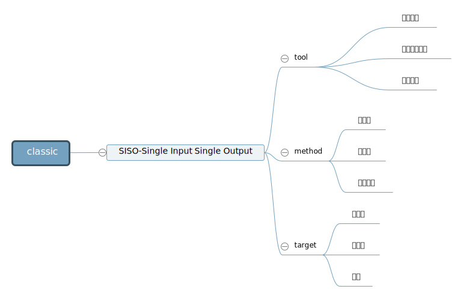
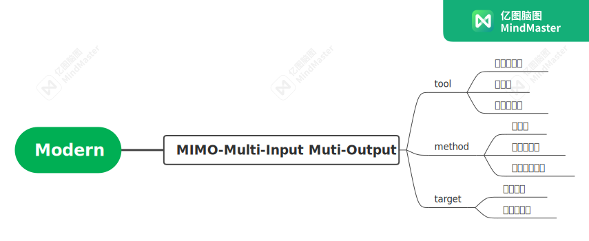
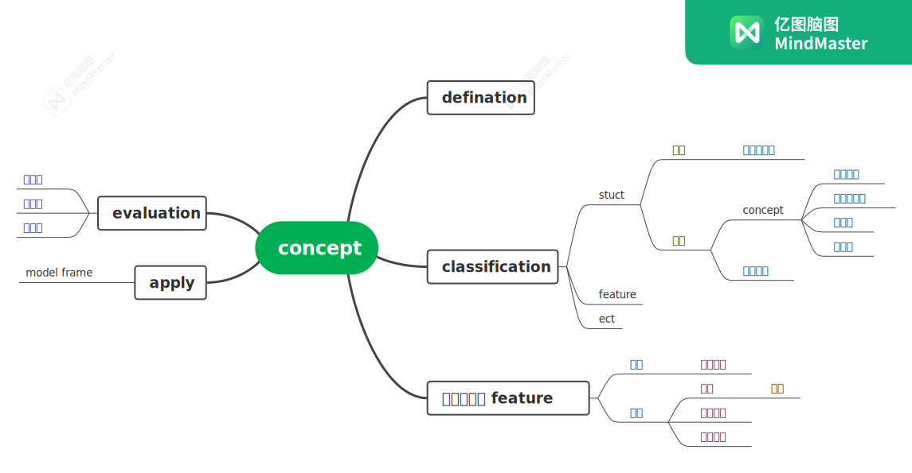
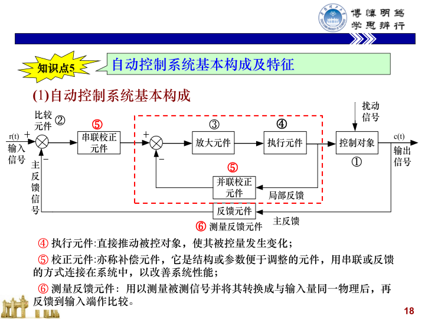

需要掌握的知识点：

1. 自动控制技术发展史
2. 自动控制基本概念 (P1、P5-7)
3. 自动控制系统基本构成及特征 (P7-9)
4. 自动控制系统分类 (P9-10)
5. 开环系统与闭环系统 (P5-7)
6. 自动控制系统基本要求 (P14-15)

## summary

1. 自动控制技术发展史

2 - 6

## hw

1. 自动控制原理的定义？特征是什么？
2. 闭环控制系统的基本环节及其作用？
3. 自动控制系统的基本要求？
4. 开环控制与闭环控制各有什么特点？
5. 简述控制系统由哪几大部分组成？
6. P17 习题 1-8
7. P17 习题 1-10

## key

