# 自动控制系统的数学模型

## 导航

- 控制系统的微分方程—建立和求解

- 线性方程的求解-拉氏变换法

- 控制系统的传递函数

- 控制系统的结构图—等效变换

- 控制系统的信号流图—梅逊公式

## 建模

- 模式

  - 深入了解系统的特性

  - 对系统进行化简

    针对问题的性质和求解的精确要求, 进行有条件地化简

- 模型之间的关系

  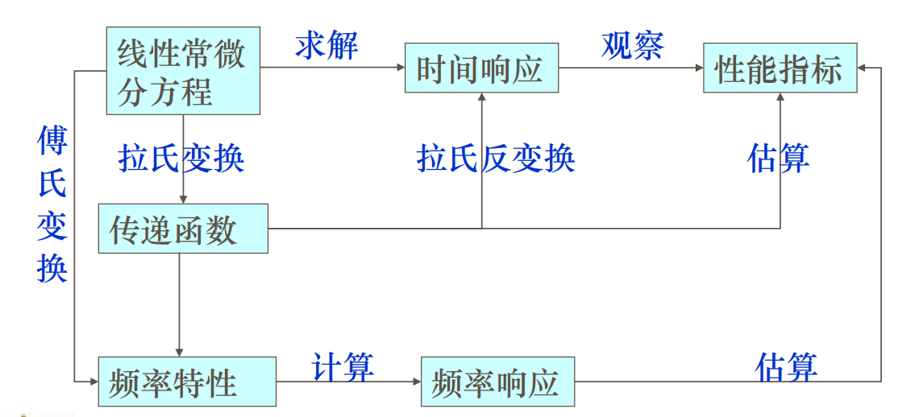

- 对象

  - 线性系统: 叠加性

  - 线性定常系统:定常(常系数)

    主要学习这一类

  - 线性时变系统:系数是时间的函数

  - 非线性系统

    利用泰勒公式进行线性化

- example

  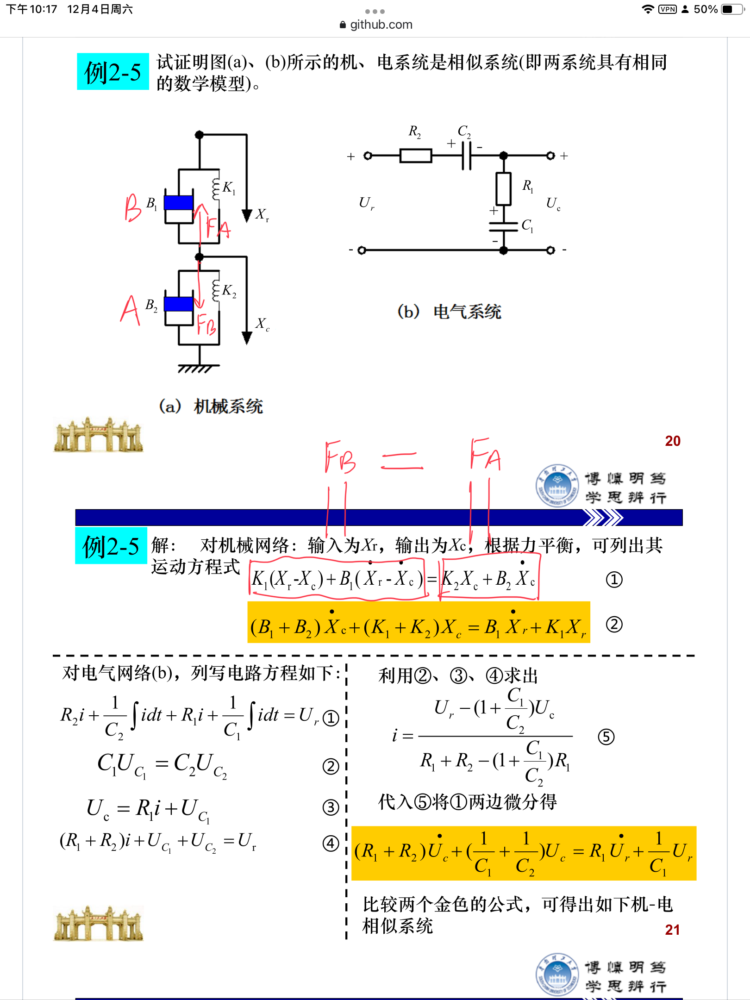

  > 数学模型上二者是等价的, 则可以用电气系统代替机械系统 -> 黑箱思想

## 规范

- 微分方程

  形式:`输出 = 输入`

## Laplace

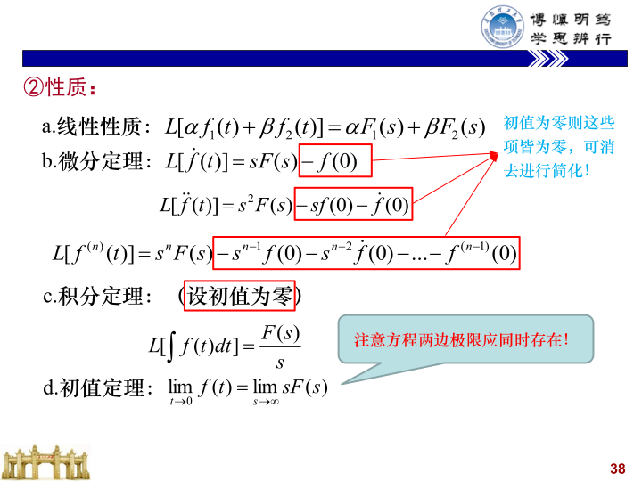

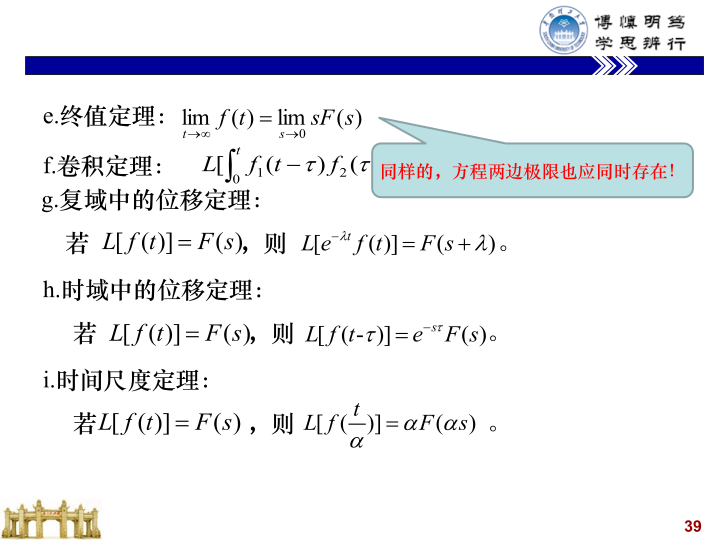

> 利用终值定理和微分定理, 可以导出微分形式

## 传递函数

- 根据 Laplace 的微分定理, 输出形式为

  响应 = 零初植响应 + 零输入响应

  零输入响应即为传递函数部分

- 形式

  - 有理分式形式

    $$
    G ( s ) = \frac { Y ( s ) } { X ( s ) } = \frac { b _ { m } s ^ { m } + b _ { m - 1 } s _ { m - 1 } ^ { m - 1 } + \cdots + b _ { 0 } } { a _ { n } s ^ { n } + a _ { n - 1 } s _ { n - 1 }^ { n - 1 } + \cdots + a _ { 0 } }
    $$

  - 零点、极点形式

    $$
    G ( s ) = \frac { Y ( s ) } { X ( s ) }= \frac { b _ { m } } { a _ { n } } \times \frac { Q ( s ) } { P ( s ) } = K _ { g } \frac { \prod _ { i = 1 } ^ { m } ( s + z _ { i } ) } { \prod _ { j = 1 } ^ { n } ( s + p _ { j } )}
    $$

    $K_g = \frac {b_m} {a_n}$: 传递系数

  - 时间常数形式

    $$
    G ( s ) = \frac { b _ { 0 } } { a _ { 0 } } \times \frac { Q ( s ) } { P ( s ) } = K \frac { \prod _ { i = 1 } ^ { m } ( \tau_i s + 1 ) } { \prod _ { j = 1 } ^ { n } ( T_j s + 1 )}
    $$

    $K = \frac {b_0} {a_0}$: 放大系数

- 修正形式

  实数

  $$
  G ( s ) = \frac { K_g } {S^{\nu}} \times \frac{\prod_{ i = 1 } ^ { m_1 } ( s + z_i  ) \prod_{k = 1}^{m_2} (S^2+2 \zeta_k \omega_k S + \omega_k^2)}{\prod_{ j = 1 } ^ { n_1 } ( s + p_j  ) \prod_{l = 1}^{n_2} (S^2+2 \zeta_l \omega_l S + \omega_l^2)}
  $$

  $$
  G ( s ) = \frac { K } {S^{\nu}} \times \frac{\prod_{ i = 1 } ^ { m_1 } ( \tau_i s + 1  ) \prod_{k = 1}^{m_2} (\tau_k^2 S^2+2 \zeta_k \tau_k S + 1)}{\prod_{ j = 1 } ^ { n_1 } ( T_j s + 1  ) \prod_{l = 1}^{n_2} (T_l^2 S^2+2 \zeta_l T_l S + 1)}
  $$

  > 对数运算的视角下, 传递函数可以分解为一些**典型环节**的线性叠加

## 典型环节

- 比例环节

- 积分环节

- 惯性环节

- 振荡环节

  $\zeta > 1$, 等价于惯性环节的叠加

- 微分环节

  纯微分, 一阶微分和二阶微分环节

- 延迟环节

## 结构图

### 等效变换

- 定义

  在结构图上进行数学方程的运算

- 原则

  变换前后环节的数学关系保持不变

  > 运用黑箱的角度观察, 随时划分出一个黑箱

- 类型

  串联, 并联和反馈

### 基本概念

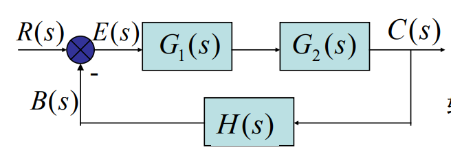

- 前向通道传递函数: $G_1(s)G_2(s)$

  前向通道指从输入端到输出端沿信号传送方向的通道

- 开环传递函数: $G_1(s)G_2(s)H(s)$

  主反馈通道断开时从输入信号到反馈信号$B(s)$之间的传递函数

- 偏差:$E(s)$

  靠偏差控制

  $$
  E(s) = R(s) - B(s)
  $$

- 系统偏差传递函数

  $$
  \begin{aligned}
  \Phi_{ E } ( s ) &= \frac { E ( s ) } { R ( s ) } = \frac { R ( s ) - C ( s ) H ( s ) } { R ( s ) }  \\
  &= 1 - \Phi ( s ) H ( s )
  \end{aligned}
  $$

- 研究单位反馈

  进行如下等效变换

  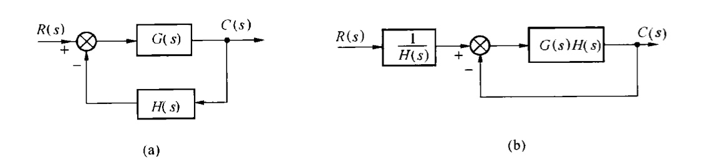

  于是只用研究`开环传递函数`, 同时可以简化研究

  - 化简

    - 开环传递函数=前向通道传递函数

    - $\Phi ( s ) = 1 - \Phi _ { E } ( s )$

    - 偏差$E(s)=R(s)-B(s)=R(s)-C(s)$就是系统误差

- 线性叠加

  $$
  \begin{aligned}
  C ( s ) &= \Phi ( s ) R ( s ) + \Phi _ { N } ( s ) N ( s ) \\
  E ( s ) &= \Phi _ { E } ( s ) R ( s ) + \Phi _ { N E } ( s ) N ( s )
  \end{aligned}
  $$

## 梅逊公式

- 节点

  相当于输出

- 思考

  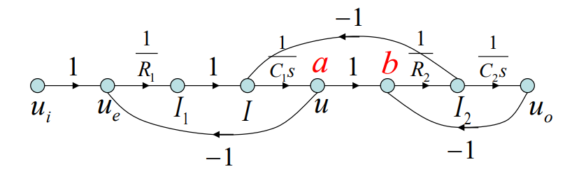

  a 点和 b 点之间的传输为 1，是否可以将该两点合并?

  > 不能, 因为 a, b 两点的信号值不一样, $b = a - u_o$

- 思考$\Delta$

  流图特征式

  传递函数的特征表达式

  对于$\frac {Y(S)} {R(s)}$, $Y(s)$可以为任意节点, 传递函数的分母是相同的

- 思考任意的输入节点

  即$\frac {Y(S)} {X(s)}$形式

  当输入节点为混合输入时, 两种方案:

  - 方案一

    把该混合节点的所有输入支路去掉,然后再用梅逊公式

  - 方案二

    $$
    \frac {Y(S)} {X(s)} = \frac {\frac {Y(S)} {R(s)}} {\frac {X(S)} {R(s)}}
    $$

    利用两次梅逊公式

### 推荐

- wiki: [梅逊公式](https://zh.m.wikipedia.org/zh-hans/%E6%A2%85%E6%A3%AE%E5%A2%9E%E7%9B%8A%E5%85%AC%E5%BC%8F)

- 练习: [梅逊(Mason)公式](https://blog.51cto.com/u_15278213/2931733)

- 推导: [梅森公式的推导和探究](https://blog.csdn.net/ILoveTheWorldSo/article/details/99762717)

  > 分母形似$( 1 - L _ { 1 } ) \cdot ( 1 - L _ { 2 } ) \cdots ( 1 - L _ { n } )$

## summary

数学模型

微分方程、传递函数、结构图、信号流图、频率特性以及状态空间描述等

## key

### 分解

PPT page 42 To page 47

## notice

微分方程的规范: 等式两端，左边输出，右边输入

传递函数的定义: 线性定常系统在**零初始条件**下，输出量的拉
氏变换与输入量的拉氏变换之比

## hw

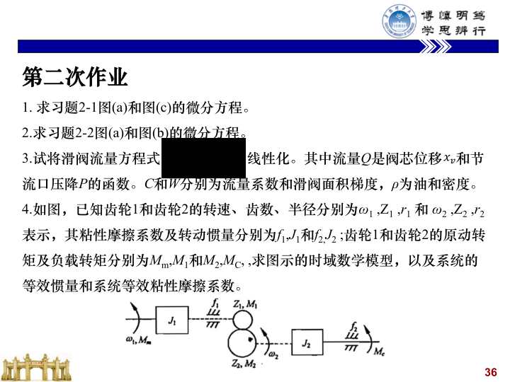

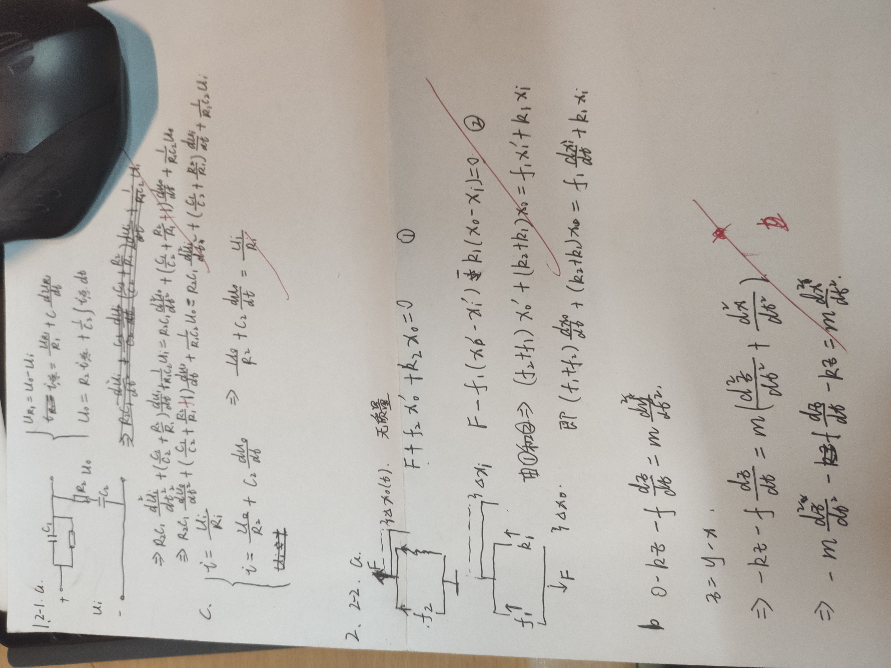

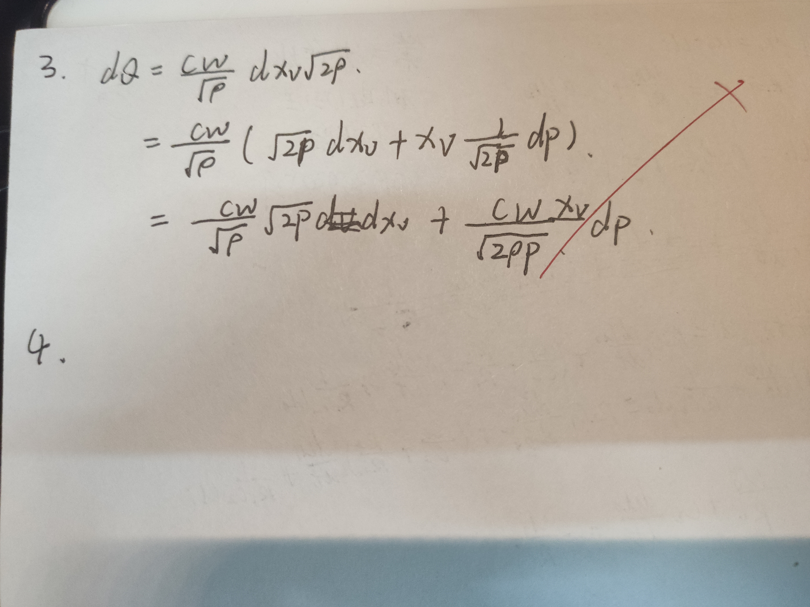

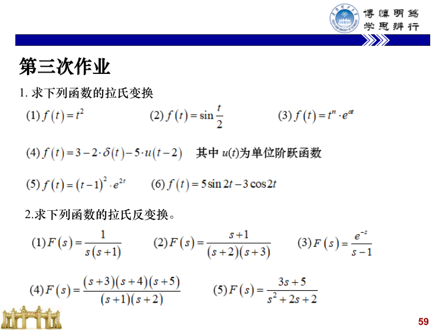

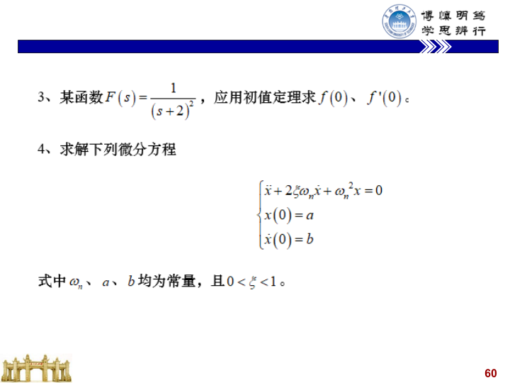

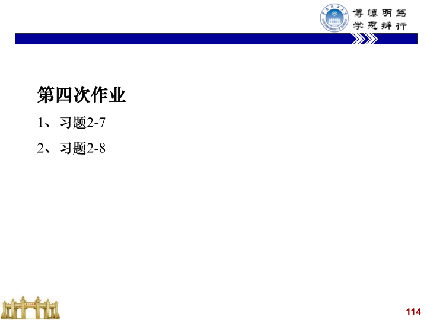

## freedom

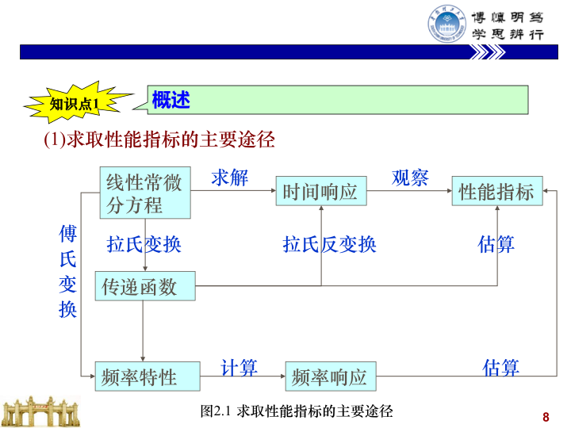

**可以看出在上一个阶层来看，从接口的角度来看，从用户的角度来开，指向的是性能指标**
