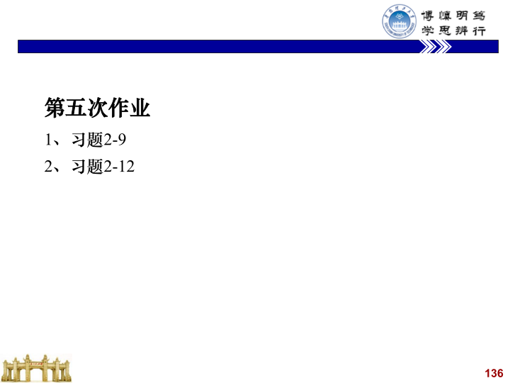

需要掌握的知识点：

1. 概述
2. 控制系统的微分方程—建立和求解
3. 线性方程的求解-拉氏变换法
4. 控制系统的传递函数
5. 控制系统的结构图—等效变换
6. 控制系统的信号流图—梅逊公式

## summary

数学模型

微分方程、传递函数、结构图、信号流图、频率特性以及状态空间描述等

## key

### Laplace

### 分解

PPT page 42 To page 47

## notice

微分方程的规范: 等式两端，左边输出，右边输入

传递函数的定义: 线性定常系统在**零初始条件**下，输出量的拉
氏变换与输入量的拉氏变换之比

## Explanation

## hw

## freedom

**可以看出在上一个阶层来看，从接口的角度来看，从用户的角度来开，指向的是性能指标**
