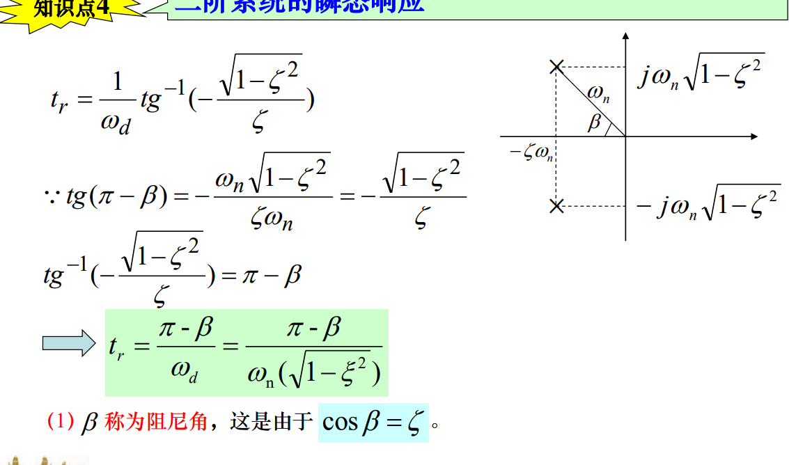
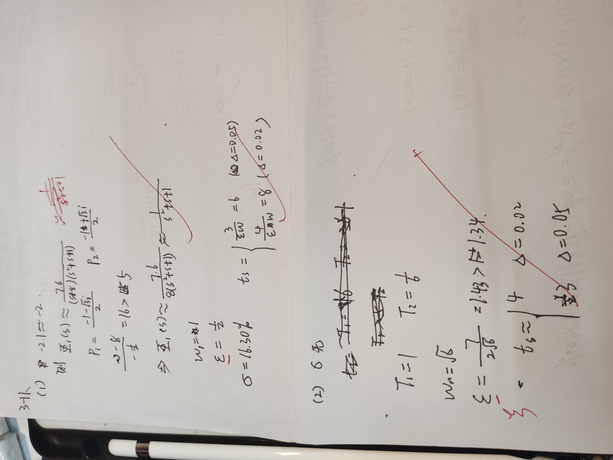
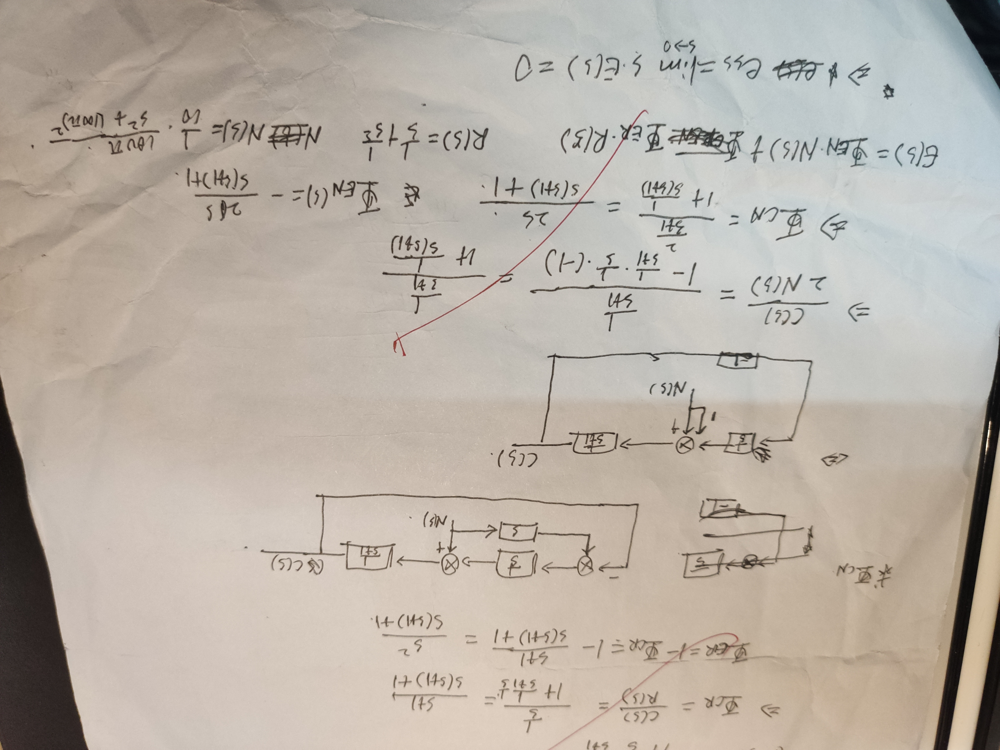

# 自动控制的时域分析

## 导航

- 稳定性的概念和代数稳定判据

- 典型输入作用和时域性能指标

- 一阶系统的瞬态响应

- 二阶系统的瞬态响应

- 高阶系统分析

- 稳态误差分析

- PID 原理

## 稳定性

- 定义

  设系统处于某一起始的平衡状态。在外作用的影响下，离开了该平衡状态。当外作用消失后，如果经过足够长的时间它能回复到原来的起始平衡状态，则称这样的系统为稳定的系统

- 充要条件

  线性定常系统

  用数学描述, 干扰就像一个类似$\delta(t)$的函数, 大部分的区间为 0. 而作用可以分解为:

  $$
  响应 = 零初值响应 + 零输入响应
  $$

  由于后续输入为 0, 所以$零输入响应=0$, 只需考虑`零初值响应`

  

  即特征方程的根应全部位于 S 平面的左半部

  > 容易知道分子次数小于分母, 否有常数项, 必然不稳定

- 分布

  

  随遇平衡状态:零根

  临界平衡状态(或临界稳定状态): 一对共轭虚根, 对应于等幅的周期振荡

## 代数判据

### 劳斯判据

- 条件

  - 特征方程的全部系数为正值

  - 由特征方程系数组成的劳思阵的第一列也为正

- 性质

  - 极点个数等于劳斯表列第一列系数符号改变的次数

  - 劳斯表某行系数全为零, 表明特征方程具有大小相等而位置径向相反的根

- 针对特殊情况

  

  

  大小相等，位置径向相反的根可以通过求解辅助方程得到。辅助方程应为偶次数的

  > 注意, 算得到 0, 并不意味着系统一定是不稳定的, 像第二种情况, 需要用`1 3 0`代替`0 0 0`

### 赫尔维茨判据

- 条件

  - $a_n > 0$

  - 由特征方程系数构成的赫尔维茨行列式的主子行列式全部为正

- 构造

  主对角线上的各项为特征方程的第二项系数 至最后一项系数 ，在主对角线以下各行中各项系数下标逐次增加，在主对角线以上各行中各项系数下标逐次减小。当下标大于 n 或小于 0 时，行列式中的项取 0

- wiki: [劳斯–赫尔维茨稳定性判据](https://zh.m.wikipedia.org/zh/%E5%8A%B3%E6%96%AF%E2%80%93%E8%B5%AB%E5%B0%94%E7%BB%B4%E8%8C%A8%E7%A8%B3%E5%AE%9A%E6%80%A7%E5%88%A4%E6%8D%AE)

## 相对稳定

利用劳斯和赫尔维茨稳定性判据确定的是系统稳定或不稳定，即绝对稳定性

- 相对稳定(稳定裕量)

  系统离临界稳定有多少裕量

- 评估方式

  作$s=\sigma$的垂线，若系统的极点都在该线的左边, 则称该系统具有$\sigma$的稳定裕度

  - 数学形式

    $$
    \begin{aligned}
    s \leq \sigma &\iff s + \sigma \leq 0 \\
    令 z = s + \sigma &\iff z \leq 0 \\
    \end{aligned}
    $$

    将$s=z-\sigma$带入, 利用代数判据

## 时域分析

- 时域分析的概念

  指控制系统在**一定的输入下**，根据**输出量的时域表达式**，分析系统的稳定性、瞬态和稳态性能

- 输入选择

  当系统的输入具有突变性质时, 可选择阶跃函数为典型输入信号

  当系统的输入是随时间增长变化时，可选择斜坡函数为典型输入信号

### 性能指标

- 峰值时间 $t_p$

- 最大超调量(简称超调量)$\delta$%

- 调节时间或过渡过程时间 $t_s$

  反映**快速性**

#### 一阶系统(惯性环节)

- $t_p$

- $\delta$%

- $t_s$

  $$
  t _ { s } = - T \ln \Delta \% \approx
  {
  \begin{cases}
  { 4 T , } & { \Delta = 2 } \\
  { 3 T , } & { \Delta = 5 }
  \end{cases}
  }
  $$

- 调节时间常数

  - 通过负反馈减小时间常数

    

  - 在系统的前向通道上串联一个比例环节

    

#### 二阶系统

- $0 < \zeta < 1$

  - 阻尼角

    

  - $t_p$

    $$
    t _ { p } = \frac { \pi } { \omega_n \sqrt { 1 - \zeta ^ { 2 } } } = \frac { \pi } { \omega _ { d } }
    $$

  - $\delta$%

    $$
    \delta \% = e ^ { - \frac { \zeta \pi } { \sqrt { 1 - \zeta ^ { 2 } } } } \times 100 \%
    $$

  - $t_s$

    $$
    t _ { s } \approx
    {
    \begin{cases}
    \frac { 4 } { \zeta \omega_{ n } }, 当 \Delta = 2\\
    \frac { 3 } { \zeta \omega_{ n } }, 当 \Delta = 5
    \end{cases}
    }
    $$

- $\zeta = 1$

  - $t_s$

    $$
    t _ { s } \approx
    {
    \begin{cases}
    \frac { 5.84 } { \omega_{ n } }, 当 \Delta = 2\\
    \frac { 4.75 } { \omega_{ n } }, 当 \Delta = 5
    \end{cases}
    }
    $$

- $\zeta > 1$

  - $t_s$

    利用主极点的想法, 当$T_1 > T_2$时

    $$
    t _ { s } =
    {
    \begin{cases}
    { 4 T_1 , } & { \Delta = 2 } \\
    { 3 T_1 , } & { \Delta = 5 }
    \end{cases}
    }
    $$

## 主极点

针对高阶系统

> 注意 z 和 p 留下来了

## 稳态误差分析

利用终值定理

$$
e _ { s s } = \lim _ { t \rightarrow \infty } e ( t ) = \lim _ { s \rightarrow 0 } s E ( s )
$$

- 利用开环传递函数分析

  写成时间常数形式:

  $$
  G(s)=\frac {K}{s^{\nu}} \cdot G_0(s)
  $$

  知, $\lim_{s \rightarrow 0} G_0(s) = 1$, 故只需考察$\nu$

  称$\nu$为个数为系统的无差度阶数

  - 0 型系统: $\nu = 0$
  - I 型系统: $\nu = 1$
  - II 型系统: $\nu = 2$

### PID

PID 控制器通过对误差信号$e(t)$的加权计算，得到控制信号$u(t)$，驱动受控对象，使得误差$e(t)$按减少的方向变化，从而达到控制要求

## questions

## summary

## hw

 **使用这个比较合适**

## conclusion

quick review 

