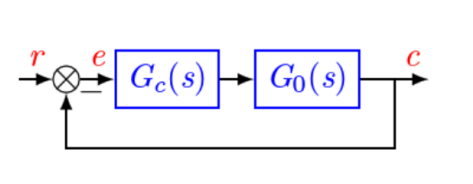
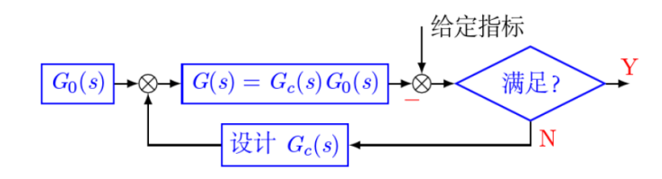
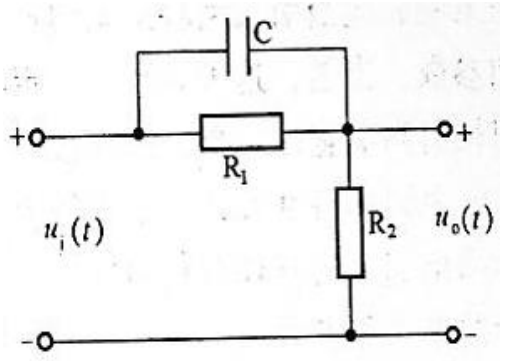
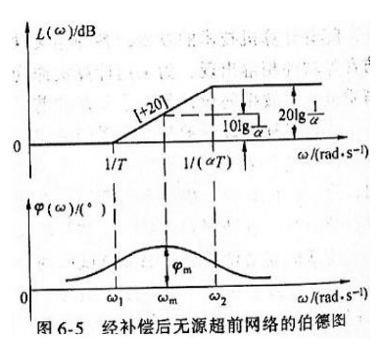
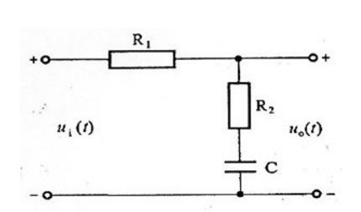
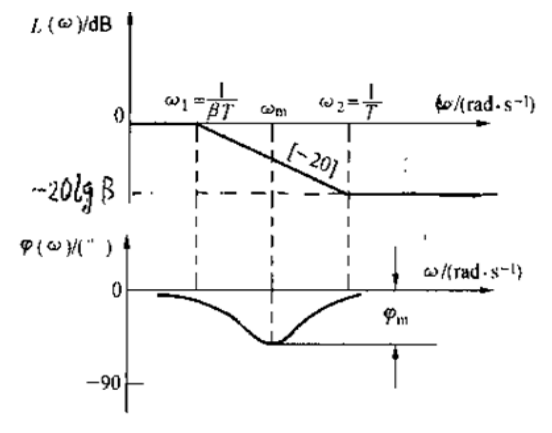
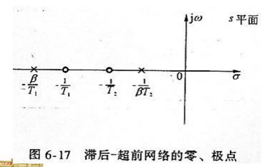
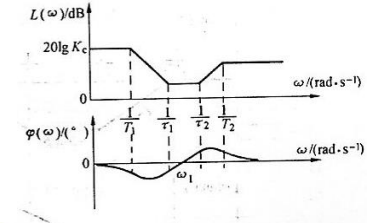

# 自动控制系统的校正

## 导航

- 常用的校正装置及其特性

- 自动控制系统的频率法校正

## 基本概念

引入一些附加装置来校正系统的暂态性能、稳态性能，使其全面满足系统性能指标要求

- 方式

  - 串联校正

  - 并联校正

  - 混合校正

- 性能指标

  无论哪种校正方式，都要求校正后系统既能快速准确跟踪输入信号，又能有效抑制噪声扰动信号

  - 输入信号: 中低频

  - 噪声信号: 高频

## 串联校正

- 设计过程

  

- $G_c(s)$不同

  - 超前校正

  - 滞后校正

  - 滞后-超前校正

### 超前校正

$$
\begin{aligned}
G _ { c } ( s ) &= \frac { T s + 1 } { \alpha T s + 1 } \\
\alpha &= \frac { R _ { 2 } } { R_1 + R_2 } \lt 1 ; T = R _ { 1 } C
\end{aligned}
$$

中间一段与微分作用相同, 故这种网络称为
微分校正网络

相频始终为正, 意即网络的输出信号在相位上总是超前与输入信号的, 故称超前网络

- 最大超前相角

  $$
  \begin{aligned}
  \omega _ { m } &= \frac { 1 } { T \sqrt { \alpha } } = \sqrt {\omega_1 \omega_2} \\
  \varphi _ { m } &= \arctan \frac { 1 - \alpha } { 2 \sqrt { \alpha } }\\
  \frac { 1 } { \alpha } &= \frac { 1 + \sin \varphi _ { m } } { 1 - \sin \varphi _ { m } }\\
  L ( \omega _ { m } ) &= 10 \log \frac { 1 } { \alpha }
  \end{aligned}
  $$

  > $\alpha$的三角形更有价值

### 滞后校正

$$
\begin{aligned}
G _ { c } ( s ) = \frac { T s + 1 } { \beta T s  + 1 } &, T = R _ { 2 } C _ { s }  \\
G _ { c } ( j a ) = \frac { j T \omega + 1 } { j \beta T \omega + 1 } &, \beta = \frac { R_1+R_2}{R_2}
\end{aligned}
$$

积分校正网络

滞后网络

- 最大滞后相角

  $$
  \begin{aligned}
  \omega _ { m } &= \frac { 1 } { T \sqrt { \beta } } = \sqrt {\omega_1 \omega_2} \\
  \varphi _ { m } &= \arctan \frac { 1 - \beta } { 2 \sqrt { \beta } }\\
  \frac { 1 } { \beta } &= \frac { 1 + \sin \varphi _ { m } } { 1 - \sin \varphi _ { m } }\\
  L ( \omega _ { m } ) &= 10 \log \frac { 1 } { \beta }
  \end{aligned}
  $$

  应力图避免网络使其$\varphi_m$出现在校正后系统的开环截止频率$\omega_c^{\prime}$的附近, 通常:

  $$
  \omega_2 = \frac {1} {T} \ll \omega_c^{\prime}
  $$

因为$\beta > 1$, 极点比零点更靠近原点, 若 T 足夠大,则滞后网络提供一对靠近原点的开环偶极子,在不影响远离偶极子处根轨迹前
提下,大大提高稳态性能

### 滞后-超前校正

滞后-超前校正是利用滞后校正部分提供的靠近原点的开环偶极子$[-\frac {1} {T_2},- \frac {1} {\beta T_2}]$, 提高系统稳态性能，利用超前校正部分提供的零、极点$(-\frac {1} {T_1},- \frac {\beta} {T_1})$提高系统的动态品质

$$
G _ { c } ( s ) = \frac { ( s + \frac { 1 } { T _ { 1 } } ) ( s + \frac { 1 } { T _ { 2 } } ) } { ( s + \frac { \beta } { T _ { 1 } } ) ( s + \frac { 1 } { \beta T _ { 2 } } ) }
$$

## 频率法校正

- 开环频率特性指标

  - 截止频率$\omega_c$

  - 相角稳定裕度$\gamma$

  - 幅值稳定裕度$L_g$

  - 中频宽度$h$

### 超前校正

- 核心

  - $\omega_c = \omega_m$

  - 叠加性

    $\varphi_m = \gamma^{\prime} - \gamma + \Delta$

  - 幅值 = 0

> 通过向上平移幅值和补偿相角, 此时$\omega_c$增大

### 滞后校正

- 核心

  - $\omega_2 = 0.1 \omega_c^{\prime}$

  - 幅值 = 0

> 通过向下平移幅值, $\omega_c$较小获得较大的相角裕度, 计算时相角应稍大一些

### 滞后-超前校正

$\beta = \frac {1} {\alpha}$

- 核心

  - 滞后保证幅值=0

  - 超前$L(\frac {1} {T_1}) = -20dB$
